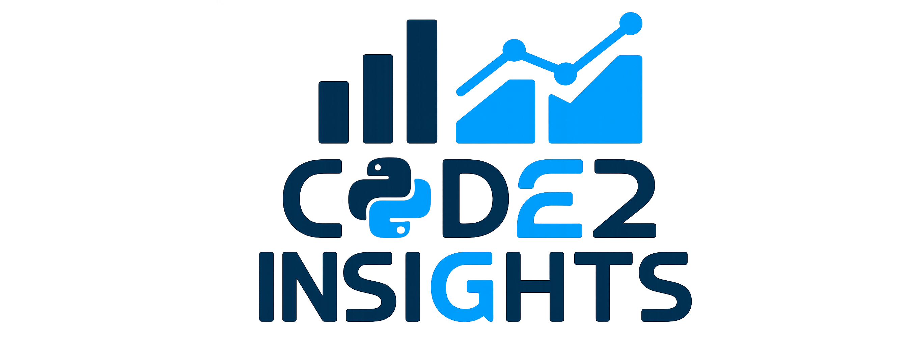
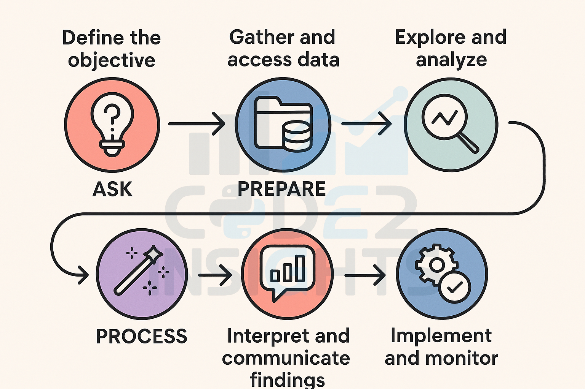

# Welcome to the Code2Insight

This repository serves as a comprehensive analytics project, systematically documenting the end-to-end data lifecycle. It features a series of well-documented Jupyter notebooks and Python scripts for the entire process, including initial raw data cleaning, methodical data manipulation, and the creation of insightful visualizations. The project is organized to clearly demonstrate the transformation of unstructured information into actionable business intelligence.

This repository is designed on a modular architecture, with each component designed for reusability and easy maintenance. The core functionalities are separated into the following Python components:

> **Data Ingestion & Cleaning**: Scripts and notebooks handle the initial data processing, including outlier detection, missing value imputation, and data type correction.

> **Data Manipulation & Feature Engineering**: Dedicated modules are used for complex data restructuring, aggregation, and the creation of new features critical for downstream analysis.

> **Exploratory Data Analysis (EDA) & Visualization**: Interactive Jupyter notebooks drive the data exploration process, where we perform in-depth analysis and generate custom visualizations using Matplotlib and Seaborn. These visuals are instrumental in identifying key patterns like trends, and relationships hidden within the dataset.

This setup ensures a reproducible and transparent analytical process, moving from raw information to comprehensive, data-driven conclusions.

## Pre-requisites Software, Tools, Libraries, and Platforms

Your software stack is determined by your chosen programming languages and analysis goals.

### Programming Languages
> **Python**: Widely used for its simplicity and extensive libraries like Pandas, NumPy, Scikit-learn, and Matplotlib for data manipulation, analysis, and visualization. 
Official Link: https://www.python.org

> **R**: Specializes in statistical analysis and advanced data visualization, with popular libraries like ggplot2 and dplyr. 
> Official Link: https://www.r-project.org

### Python Libraries
A variety of powerful and well-supported libraries exist for every stage of the process, including data collection, processing, visualization, and modeling.

#### Data manipulation and processing
> **Pandas**: The most fundamental library for data analysis, providing powerful, flexible data structures like the DataFrame for handling and analyzing structured data. 
> Official Link: https://pandas.pydata.org

> **NumPy**: Essential for numerical computing, providing support for large, multi-dimensional arrays and matrices, along with a collection of mathematical functions to operate on this data efficiently. 
> Official Link: https://numpy.org

> **Dask**: A flexible library for parallel computing and handling big data that exceeds memory limits. It extends the functionality of Pandas and NumPy to distributed environments. 
> Official Link: https://dask.org

#### Data Visualization
> **Matplotlib**: A highly flexible and foundational plotting library for creating a wide range of static, animated, and interactive plots.

> **Seaborn**: Built on top of Matplotlib, this library provides a higher-level, aesthetically pleasing interface for creating informative statistical graphics.

> **Plotly**: An interactive visualization library used to create a wide variety of web-based plots and dashboards. Unlike Matplotlib, it is optimized for web applications.

> **Bokeh**: Another library for creating interactive plots and data applications for modern web browsers, ideal for visualizing streaming data or creating dashboards.

#### Inferential and advanced statistics
> **SciPy**: The scipy.stats module is a comprehensive library for inferential statistics and probability. It offers a wide range of functions, including:
> - **Hypothesis tests**: T-tests (ttest_ind, ttest_rel), ANOVA (f_oneway), and chi-squared tests (chi2_contingency).
> - **Statistical functions**: Functions for calculating skewness, kurtosis, and various probability distributions (e.g., normal, gamma, uniform).
> - **Descriptive statistics**: Advanced summary statistics like the interquartile range (iqr) and trimmed mean. 
> Official Link: https://docs.scipy.org/doc/scipy/reference/stats.html

### Development and Data Management
> **Anaconda/Miniconda**: A distribution that simplifies package and environment management for Python and R. It comes with tools like Jupyter Notebooks for interactive coding and visualization. 
> Official Link: https://docs.anaconda.com/anaconda/install/

<blockquote><b>Databases</b>: Systems like MySQL, PostgreSQL (SQL databases), and MongoDB (NoSQL) are used for querying and managing data in databases. Essential for data extraction, manipulation, and loading (ETL). 
 
Official Links:
<li><a href="https://www.postgresql.org">https://www.postgresql.org</a></li>
<li><a href="https://www.mysql.com">https://www.mysql.com</a></li>
<li><a href="https://www.mongodb.com">https://www.mongodb.com</a></li>
<li><a href="https://www.integrate.io/blog/top-7-etl-tools/">https://www.integrate.io/blog/top-7-etl-tools/</a></li>
</blockquote>

### Datasets
These platforms offer a wide variety of datasets, making them ideal for learning, experimentation, and exploratory analysis. 
> **Kaggle**: A highly popular online community for data scientists and machine learning enthusiasts.
> Official Link: https://www.kaggle.com

> **data.world**: A platform where users and organizations can discover and share data. 
> Official Link: https://data.world

> **Google Dataset Search**: A search engine specifically for finding datasets from thousands of repositories across the web, including government websites and academic institutions. 
> Official Link: https://datasetsearch.research.google.com

> **Reddit r/datasets**: A community forum where users share and discuss interesting and unique datasets. 
> Official Link: https://www.reddit.com/r/datasets

### Data collection and management

A complete data analytics setup requires defining sources and managing the data lifecycle.
> **Data Sources**: Data can be collected from numerous sources, including internal databases, third-party APIs, web scraping, and external datasets from sources like government agencies.

<blockquote><b>Data Collection Methods</b>: Choose methods based on your objectives. Options include:
<li>Surveys</li>
<li>Interviews</li>
<li>Observations</li>
<li>Experiments</li>
<li>Internal company records</li>
</blockquote>

## Data analytics workflow

<blockquote>

**Define the objective (ask)**:
- Clearly articulate the business problem or question you are trying to solve.
- Establish Key Performance Indicators (KPIs) and metrics to measure success.
- Identify the target audience or stakeholders and their expectations for the analysis.
- Determine the scope of the project and potential constraints or assumptions.

**Gather and access data (prepare)**:
- Identify and secure access to all relevant data sources, both internal and external.
- Determine the type of data required (e.g., demographic, transactional, behavioral).
- Understand the data lineage (how data was collected, processed, and stored).
- Assess data availability and any potential limitations or biases in the sources.

**Clean and prepare data (process)**:
- Identify and address data quality issues: missing values, duplicates, outliers, and inconsistencies.
- Standardize data formats and types across different sources.
- Transform data as needed for analysis: normalize, scale, aggregate, and create new features (feature engineering).
- Document cleaning steps and assumptions for reproducibility.

**Explore and analyze**:
- Perform Exploratory Data Analysis (EDA) using visualizations and summary statistics to understand patterns, trends, and relationships.
- Select and apply appropriate analytical techniques: descriptive, diagnostic, predictive, or prescriptive analytics, based on the objective.
- Develop and validate models (if applicable): choose algorithms, train models, tune parameters, and assess performance.
- Iterate on analysis and modeling as new insights emerge or the problem definition evolves.

**Interpret and communicate findings (share):**
- Interpret results in the context of the business problem and original objectives.
- Quantify the impact and value of insights for stakeholders.
- Present findings clearly and concisely using effective data visualization libraries (e.g., Matplotlib, Seaborn, Plotly, etc.).
- Develop a data story that connects insights to business implications and recommended actions.

**Implement and monitor (act)**:
- Translate insights into actionable recommendations and integrate them into business processes.
- Deploy models (if applicable) for ongoing use in production environments.
- Monitor key metrics and track the impact of implemented changes over time.
- Establish feedback loops to continuously evaluate effectiveness and refine the analysis process.

</blockquote>

## Mathematics for Data Analytics
Here are key mathematical areas for data analytics and some references for further learning:

### Probability and Statistics
This is the most critical area of mathematics for data analytics, as it is used to summarize, interpret, and make predictions from data.
<blockquote>

**Descriptive statistics**: Used to summarize and describe the main features of a dataset.

**Inferential statistics**: Involves using a sample of data to make predictions or draw conclusions about a larger population.

**Probability distributions**: Used to model random events, such as the normal, binomial, and Poisson distributions.

**Hypothesis testing**: Used to determine if a set of data provides enough evidence to support a particular conclusion.</blockquote>

### Linear Algebra
This field is fundamental for representing and manipulating data, which is often stored in matrices and vectors. 

<blockquote>

**Vectors and matrices**: How datasets are represented and manipulated.

**Matrix operations**: Including addition, multiplication, and transposition, which are used to perform complex calculations on datasets.

**Eigenvalues and eigenvectors**: Used in dimensionality reduction techniques like Principal Component Analysis (PCA) to find the most important features in a dataset.
</blockquote>

Enjoy Cde2Insights!
